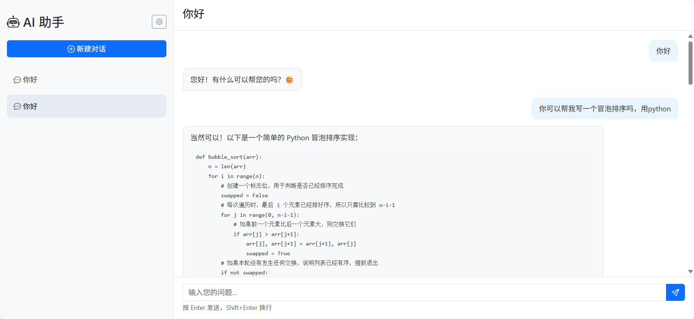

# AI 智能助手聊天应用

一个基于 Flask 和 LangChain 的智能聊天应用，支持多会话管理、Markdown 渲染和日志记录功能。

## 功能特点

- 🤖 基于 LangChain 和 Qwen 大模型的智能对话
- 💬 多会话管理，支持创建、切换和删除会话
- 📝 支持 Markdown 渲染，可以显示格式化文本和代码块
- 💾 自动保存会话到本地存储，刷新页面不会丢失对话
- 📱 响应式设计，适配不同屏幕尺寸
- 📊 完整的日志记录和管理后台

## 技术栈

- **后端**：Flask, SQLAlchemy, LangChain
- **前端**：HTML5, CSS3, JavaScript (原生), Bootstrap 5
- **数据库**：MySQL
- **AI 模型**：Qwen 大模型

## 安装步骤

### 1. 克隆仓库

```bash
git clone <仓库地址>
cd chat_app
```

### 2. 安装依赖

```bash
pip install -r requirements.txt
```

### 3. 配置数据库

```bash
在init_db.py文件中配置数据库初始化sql语句
```
### 4. 配置 LangChain 模型

```bash
在config.py文件中配置 LangChain 模型路径
```

### 5. 启动应用

```bash
windows: 直接启动start_windows.bat
启动成功直接访问localhost:5000
```

